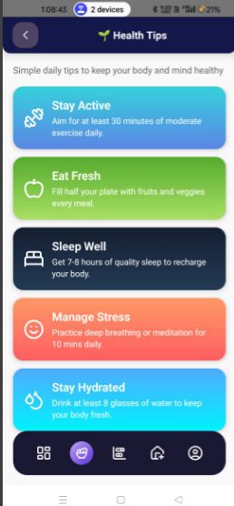

Steps followed to create this project
framwork used : react native
language used : typescript

state management tools : react usestate only
data storage : react native asyncstorage

libraries used : {
"@react-native-async-storage/async-storage": for data storage ,

"@react-navigation/bottom-tabs": "^7.4.7": create bottom tabbar of app,
"@react-navigation/native": handle navigation of screens,
"@react-navigation/native-stack": screens to arrage in stack,
"@react-navigation/stack": screens to arrange in stack navigator,
"lucide-react-native": Icons to display,
"react-native-animated-spinkit": show loder where loading state invoke,
"react-native-linear-gradient": gradient effects,

},

instructions to run app
cd fyxlife
npx react-native run-android

App OverView

Welcome Screen :
Welcome screen with carousel items for health tips and get started button

UserInfo Screen :
form and input fields related to health and saving in asycn storage of mobile

DashBoard screen :
showing user Goal card with progress bar for eat,meditation,hydration

HealthTip Screen :
showing screen of healthtips for good health just read only screen with cards

Progress Screen:

Risky Ometer Screen :
Read only screen showing risklevel,risk description regards to various disorders

UserProfile Screen :
showing user information saved in asyncstorage while filling user information

